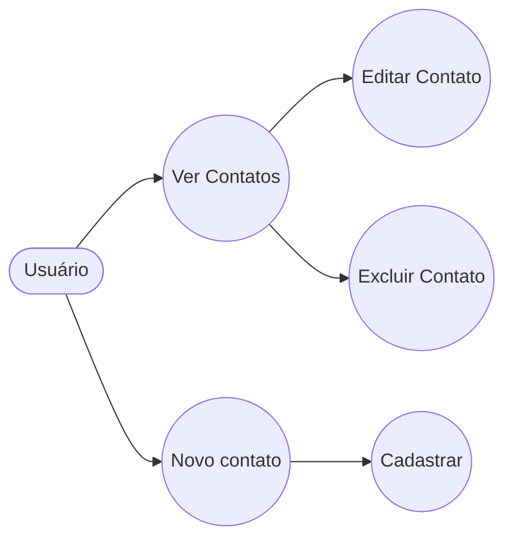

# Projeto Agenda de Contatos

Sistema desktop para **gerenciamento de contatos** desenvolvido em **Python** utilizando **PySide6** para a interface gráfica e **MySQL** como banco de dados.

O projeto segue conceitos de **Programação Orientada a Objetos (POO)** e implementa operações **CRUD (Create, Read, Update, Delete)**.

---
## Caso de Uso

# Objetivo do Projeto

O objetivo deste projeto é demonstrar a criação de uma aplicação completa com:

- Interface gráfica
- Banco de dados
- Organização modular de código
- Boas práticas de programação
- Modelagem orientada a objetos

Este sistema permite que um usuário gerencie contatos através de uma interface simples e intuitiva.
 ## Funcionalidades

O sistema de **Agenda de Contatos** possui as seguintes funcionalidades principais:

###  Cadastro de Contatos
Permite adicionar novos contatos ao sistema através de um formulário.

Campos disponíveis:

- Nome
- Email
- Telefone

Validações implementadas:

- Todos os campos são obrigatórios
- Verificação básica de email
- Telefone único no banco de dados

---

###  Listagem de Contatos

Exibe todos os contatos cadastrados em uma **tabela interativa**.

Informações exibidas:

- ID do contato
- Nome
- Email
- Telefone

Recursos disponíveis:

- Seleção de linha
- Atualização da tabela
- Ordenação de colunas
- Interface em modo escuro

---

###  Edição de Contatos

Permite alterar os dados de um contato já existente no banco de dados.

O usuário pode modificar:

- Nome
- Email
- Telefone

Após salvar as alterações, a lista de contatos é atualizada automaticamente.

---

###  Exclusão de Contatos

Permite remover um contato do sistema.

Antes da exclusão, o sistema solicita uma **confirmação do usuário**, evitando remoções acidentais.

---

###  Atualização da Tabela

Permite recarregar os dados da tabela de contatos diretamente do banco de dados.

Isso garante que as informações exibidas estejam sempre atualizadas.

---

###  Interface Moderna

O sistema possui uma interface gráfica desenvolvida com **PySide6**, contendo:

- Modo escuro (Dark Mode)
- Botões estilizados
- Tabela interativa
- Campos de entrada personalizados
---

    